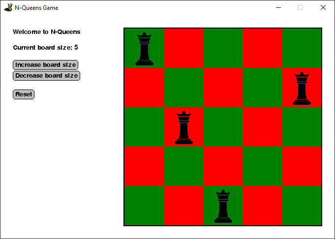

# N-Queens in Python

*An implementation of the classic N-Queens Problem using Codeskulptor or SimpleGUICS2Pygame*

Available online here: http://www.codeskulptor.org/#user47_vI5nUdL1FnU671v_1.py

Please note you may have to run the code a couple of times to get it to work in Codeskulptor. I think this is to do with image/sound loading times.

Investigation: which sizes of board are solvable?

